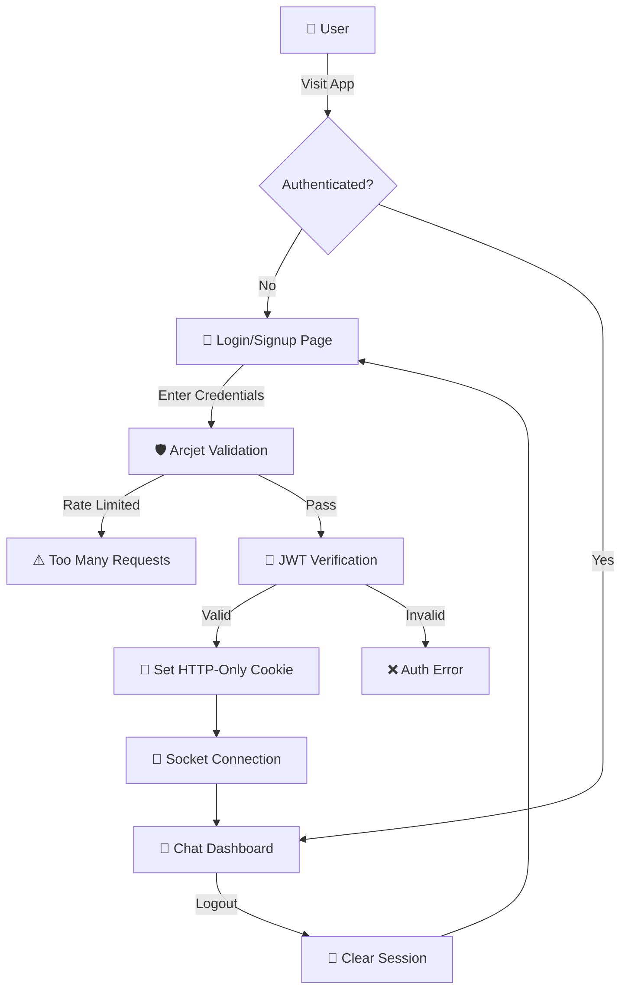
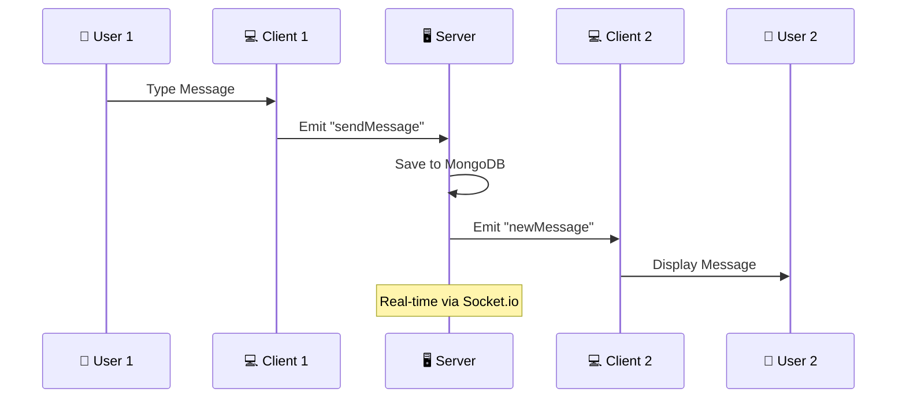
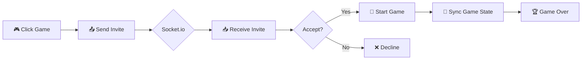

<div align="center">

# 💬 ChatApp


<br/>


<br/>

[](https://github.com/yourusername/chatapp)
[](LICENSE)
[](http://makeapullrequest.com)

</div>

---

## 🌟 Overview

**ChatApp** is a modern, feature-rich real-time messaging application that combines seamless communication with interactive multiplayer games. Built with the MERN stack and Socket.io, it delivers instant messaging with enterprise-grade security powered by **Arcjet Rate Limiting**.

<div align="center">

</div>

---

## ✨ Features

<table>
<tr>
<td width="50%">

### 💬 Real-Time Messaging
- Instant message delivery with Socket.io
- Online/Offline status indicators
- Message history persistence
- Image sharing via Cloudinary

</td>
<td width="50%">

### 🎮 Multiplayer Games
- Play games while chatting
- Real-time game synchronization
- Game invites & notifications
- 4 exciting games to choose from

</td>
</tr>
<tr>
<td width="50%">

### 🔒 Security Features
- JWT Authentication
- HTTP-only cookies
- Arcjet Rate Limiting
- Protected API routes

</td>
<td width="50%">

### 🎨 Modern UI/UX
- Beautiful dark theme
- Responsive design
- Smooth animations
- Intuitive navigation

</td>
</tr>
</table>

---

## 🎮 Games Available

<div align="center">

| Game | Icon | Description | Players |
|------|------|-------------|---------|
| **Tic Tac Toe** | ⭕ | Classic X and O game | 2 |
| **Snake & Ladders** | 🐍 | Roll dice, climb ladders, avoid snakes | 2 |
| **Sudoku Race** | 🔢 | Competitive puzzle solving | 2 |
| **Carrom** | 🎯 | Strike and pocket coins | 2 |

</div>

<div align="center">

</div>

---

## 🛡️ Rate Limiting with Arcjet

<div align="center">

```
┌─────────────────────────────────────────────────────────────┐
│                    🛡️ ARCJET PROTECTION                     │
├─────────────────────────────────────────────────────────────┤
│                                                             │
│   🚦 Rate Limiting    │   🤖 Bot Detection                  │
│   ─────────────────   │   ───────────────                   │
│   • 100 req/15min     │   • Automated blocking              │
│   • Token bucket      │   • Suspicious activity             │
│   • IP-based          │   • Real-time analysis              │
│                                                             │
│   📧 Email Validation │   🔐 Shield Protection              │
│   ─────────────────── │   ────────────────────              │
│   • Format check      │   • SQL injection                   │
│   • Disposable block  │   • XSS prevention                  │
│   • MX record verify  │   • Attack mitigation               │
│                                                             │
└─────────────────────────────────────────────────────────────┘
```

</div>

### Why Arcjet?

| Feature | Benefit |
|---------|---------|
| **Token Bucket Algorithm** | Smooth rate limiting without sudden blocks |
| **Shield Mode** | Protects against common web attacks |
| **Email Validation** | Prevents fake/disposable email signups |
| **Real-time Analytics** | Monitor threats in Arcjet dashboard |

```javascript
// Arcjet Configuration
const aj = arcjet({
  key: process.env.ARCJET_KEY,
  rules: [
    tokenBucket({
      mode: "LIVE",
      refillRate: 100,     // tokens per interval
      interval: "15m",     // 15 minutes
      capacity: 100,       // max bucket size
    }),
    validateEmail({
      mode: "LIVE",
      block: ["DISPOSABLE", "INVALID", "NO_MX_RECORDS"],
    }),
    shield({ mode: "LIVE" }),
    detectBot({ mode: "LIVE", allow: [] }),
  ],
});
```

---

## 🔄 Application Flow

### Authentication Flow



### Real-Time Messaging Flow



### Game Invitation Flow



---

## 🏗️ Architecture

```
┌─────────────────────────────────────────────────────────────────────┐
│                           FRONTEND                                  |
│  ┌─────────────┐  ┌─────────────┐  ┌─────────────┐  ┌─────────────┐ │
│  │    React    │  │   Zustand   │  │  Socket.io  │  │  Tailwind   │ │
│  │  Components │  │    Store    │  │   Client    │  │     CSS     │ │
│  └──────┬──────┘  └──────┬──────┘  └──────┬──────┘  └─────────────┘ │
│         │                │                │                         |
└─────────┼────────────────┼────────────────┼─────────────────────────|
          │                │                │
          ▼                ▼                ▼
┌─────────────────────────────────────────────────────────────────────┐
│                         HTTP / WebSocket                            |
└─────────────────────────────────────────────────────────────────────┘
          │                │                │
          ▼                ▼                ▼
┌─────────────────────────────────────────────────────────────────────┐
│                            BACKEND                                  |
│  ┌─────────────┐  ┌─────────────┐  ┌─────────────┐  ┌─────────────┐ │
│  │   Express   │  │  Socket.io  │  │   Arcjet    │  │ Cloudinary  │ │
│  │   Server    │  │   Server    │  │  Security   │  │   Images    │ │
│  └──────┬──────┘  └──────┬──────┘  └──────┬──────┘  └──────┬──────┘ │
│         │                │                │                │        |
│         └────────────────┴────────────────┴────────────────┘        |
│                                  │                                  |
└──────────────────────────────────┼──────────────────────────────────|
                                   │
                                   ▼
┌─────────────────────────────────────────────────────────────────────┐
│                          DATABASE                                   |
│                    ┌─────────────────┐                              |
│                    │    MongoDB      │                              |
│                    │    Atlas        │                              |
│                    └─────────────────┘                              |
└─────────────────────────────────────────────────────────────────────┘
```

---

## 📁 Project Structure

```
ChatApp/
├── 📂 backend/
│   ├── 📂 src/
│   │   ├── 📂 controllers/      # Route handlers
│   │   │   ├── auth.controller.js
│   │   │   └── messages.controller.js
│   │   ├── 📂 lib/              # Core utilities
│   │   │   ├── arcjet.js        # 🛡️ Rate limiting
│   │   │   ├── cloudinary.js    # ☁️ Image uploads
│   │   │   ├── db.js            # 🗄️ MongoDB connection
│   │   │   ├── socket.js        # 🔌 WebSocket setup
│   │   │   └── utils.js         # 🔧 Helper functions
│   │   ├── 📂 middleware/       # Express middleware
│   │   │   ├── arcjet.middleware.js
│   │   │   ├── auth.middleware.js
│   │   │   └── socket.auth.middleware.js
│   │   ├── 📂 models/           # MongoDB schemas
│   │   │   ├── Messages.model.js
│   │   │   └── User.model.js
│   │   ├── 📂 routes/           # API routes
│   │   └── server.js            # Entry point
│   └── package.json
│
├── 📂 frontend/
│   ├── 📂 src/
│   │   ├── 📂 components/       # React components
│   │   │   ├── 📂 games/        # 🎮 Game components
│   │   │   │   ├── GamesModal.jsx
│   │   │   │   ├── TicTacToe.jsx
│   │   │   │   ├── SnakeLadders.jsx
│   │   │   │   ├── SudokuGame.jsx
│   │   │   │   └── CarromGame.jsx
│   │   │   ├── ChatContainer.jsx
│   │   │   ├── ChatHeader.jsx
│   │   │   └── MessageInput.jsx
│   │   ├── 📂 pages/            # Page components
│   │   ├── 📂 store/            # Zustand stores
│   │   └── 📂 lib/              # Utilities
│   └── package.json
│
└── README.md
```

---

## 🚀 Getting Started

### Prerequisites

- Node.js v18+
- MongoDB Atlas account
- Cloudinary account
- Arcjet account

### Installation

```bash
# Clone the repository
git clone https://github.com/yourusername/chatapp.git
cd chatapp

# Install dependencies
npm install
cd backend && npm install
cd ../frontend && npm install
```

### Environment Variables

Create `.env` file in the backend folder:

```env
# Server
PORT=4000
NODE_ENV=development

# Database
MONGODB_URI=mongodb+srv://your-connection-string

# Authentication
JWT_SECRET=your-super-secret-key

# Cloudinary
CLOUDINARY_CLOUD_NAME=your-cloud-name
CLOUDINARY_API_KEY=your-api-key
CLOUDINARY_API_SECRET=your-api-secret

# Arcjet
ARCJET_KEY=your-arcjet-key
```

### Run the Application

```bash
# Start backend (from backend folder)
npm run dev

# Start frontend (from frontend folder)
npm run dev
```

Open [http://localhost:5173](http://localhost:5173) in your browser 🚀

---

## 📸 Screenshots

<div align="center">

### Login Page


### Chat Interface


### Games Modal


</div>

---

## 🔧 API Endpoints

### Authentication

| Method | Endpoint | Description | Rate Limited |
|--------|----------|-------------|--------------|
| `POST` | `/api/auth/signup` | Register new user | ✅ |
| `POST` | `/api/auth/login` | User login | ✅ |
| `POST` | `/api/auth/logout` | User logout | ❌ |
| `GET` | `/api/auth/check` | Check auth status | ❌ |
| `PUT` | `/api/auth/update-profile` | Update profile | ✅ |

### Messages

| Method | Endpoint | Description | Rate Limited |
|--------|----------|-------------|--------------|
| `GET` | `/api/messages/users` | Get all users | ❌ |
| `GET` | `/api/messages/:id` | Get messages with user | ❌ |
| `POST` | `/api/messages/send/:id` | Send message | ✅ |

---

## 🔌 Socket Events

### Connection Events

| Event | Direction | Description |
|-------|-----------|-------------|
| `connection` | Server | User connects |
| `disconnect` | Server | User disconnects |
| `getOnlineUsers` | Server → Client | Broadcast online users |

### Game Events

| Event | Direction | Description |
|-------|-----------|-------------|
| `gameInvite` | Client → Server | Send game invitation |
| `gameInviteReceived` | Server → Client | Receive game invitation |
| `acceptGame` | Client → Server | Accept invitation |
| `gameAccepted` | Server → Client | Game accepted notification |
| `declineGame` | Client → Server | Decline invitation |
| `exitGame` | Client → Server | Exit current game |
| `tttMove` | Bidirectional | Tic Tac Toe move |
| `snlMove` | Bidirectional | Snake & Ladders move |
| `sudokuMove` | Bidirectional | Sudoku move |
| `carromShot` | Bidirectional | Carrom shot |

---

## 🛣️ Roadmap

- [x] Real-time messaging
- [x] User authentication
- [x] Online status
- [x] Image sharing
- [x] Multiplayer games
- [x] Rate limiting with Arcjet
- [ ] Voice messages
- [ ] Video calls
- [ ] Group chats
- [ ] Message reactions
- [ ] Read receipts

---

## 🤝 Contributing

Contributions are welcome! Please feel free to submit a Pull Request.

1. Fork the project
2. Create your feature branch (`git checkout -b feature/AmazingFeature`)
3. Commit your changes (`git commit -m 'Add some AmazingFeature'`)
4. Push to the branch (`git push origin feature/AmazingFeature`)
5. Open a Pull Request

---

## 📄 License

This project is licensed under the MIT License - see the [LICENSE](LICENSE) file for details.

---

<div align="center">

### Made with ❤️ by Suman Yadav

<br/>

[](https://linkedin.com/in/yourprofile)
[](https://github.com/yourusername)

<br/>

⭐ Star this repo if you found it helpful!

</div>
